# LEDGER API – Production-Grade Flow Diagrams

## Table of Contents
1. [System Architecture](#1-system-architecture)
2. [Authentication & Authorization](#2-authentication--authorization)
3. [Transaction Processing (ACID)](#3-transaction-processing-acid)
4. [Idempotency & Retry Mechanism](#4-idempotency--retry-mechanism)
5. [Double-Entry Ledger System](#5-double-entry-ledger-system)
6. [Balance Calculation & Caching](#6-balance-calculation--caching)
7. [Reconciliation & Audit](#7-reconciliation--audit)
8. [Error Handling & Circuit Breaker](#8-error-handling--circuit-breaker)
9. [Event-Driven Architecture](#9-event-driven-architecture)
10. [Distributed Tracing & Monitoring](#10-distributed-tracing--monitoring)
11. [Rate Limiting & DDoS Protection](#11-rate-limiting--ddos-protection)
12. [Webhook Delivery System](#12-webhook-delivery-system)

---

## 1. System Architecture

### High-Level Architecture

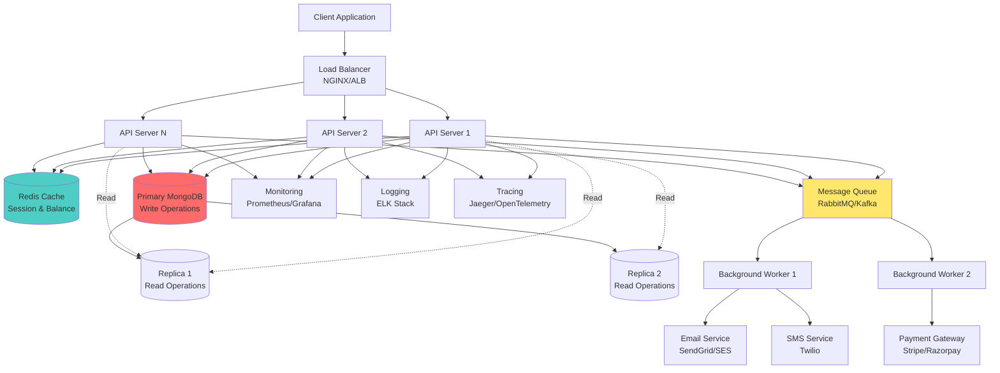
```mermaid
graph TB
    Client[Client Application]
    LB[Load Balancer<br/>NGINX/ALB]
    API1[API Server 1]
    API2[API Server 2]
    API3[API Server N]
    
    Cache[(Redis Cache<br/>Session & Balance)]
    PrimaryDB[(Primary MongoDB<br/>Write Operations)]
    ReplicaDB1[(Replica 1<br/>Read Operations)]
    ReplicaDB2[(Replica 2<br/>Read Operations)]
    
    MQ[Message Queue<br/>RabbitMQ/Kafka]
    Worker1[Background Worker 1]
    Worker2[Background Worker 2]
    
    Monitoring[Monitoring<br/>Prometheus/Grafana]
    Logging[Logging<br/>ELK Stack]
    Tracing[Tracing<br/>Jaeger/OpenTelemetry]
    
    ExtEmail[Email Service<br/>SendGrid/SES]
    ExtSMS[SMS Service<br/>Twilio]
    ExtPayment[Payment Gateway<br/>Stripe/Razorpay]
    
    Client --> LB
    LB --> API1
    LB --> API2
    LB --> API3
    
    API1 --> Cache
    API2 --> Cache
    API3 --> Cache
    
    API1 --> PrimaryDB
    API2 --> PrimaryDB
    API3 --> PrimaryDB
    
    API1 -.Read.-> ReplicaDB1
    API2 -.Read.-> ReplicaDB2
    API3 -.Read.-> ReplicaDB1
    
    PrimaryDB --> ReplicaDB1
    PrimaryDB --> ReplicaDB2
    
    API1 --> MQ
    API2 --> MQ
    API3 --> MQ
    
    MQ --> Worker1
    MQ --> Worker2
    
    Worker1 --> ExtEmail
    Worker1 --> ExtSMS
    Worker2 --> ExtPayment
    
    API1 --> Monitoring
    API2 --> Monitoring
    API3 --> Monitoring
    
    API1 --> Logging
    API2 --> Logging
    
    API1 --> Tracing
    API2 --> Tracing
    
    style PrimaryDB fill:#ff6b6b
    style Cache fill:#4ecdc4
    style MQ fill:#ffe66d
```

---

## 2. Authentication & Authorization

### User Registration Flow (with Email Verification & KYC)

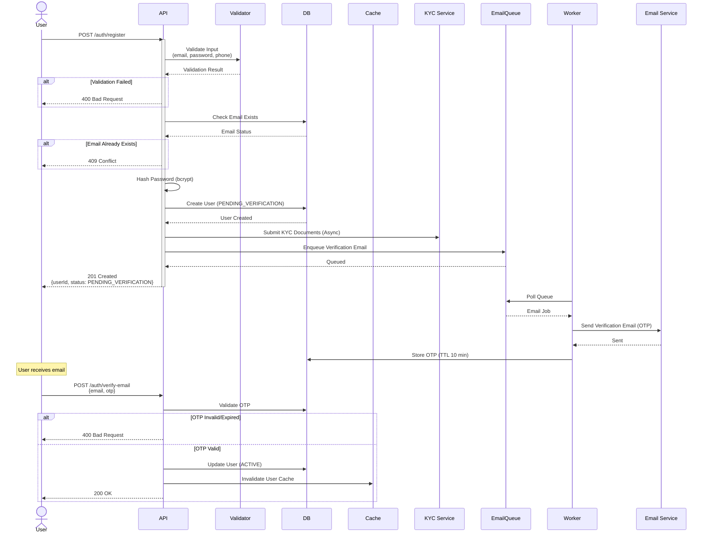
```mermaid
sequenceDiagram
    actor User
    participant API
    participant Validator
    participant DB
    participant Cache
    participant KYC as KYC Service
    participant EmailQueue
    participant Worker
    participant EmailSvc as Email Service
    
    User->>API: POST /auth/register
    activate API
    
    API->>Validator: Validate Input<br/>(email, password, phone)
    Validator-->>API: Validation Result
    
    alt Validation Failed
        API-->>User: 400 Bad Request
    end
    
    API->>DB: Check Email Exists
    DB-->>API: Email Status
    
    alt Email Already Exists
        API-->>User: 409 Conflict
    end
    
    API->>API: Hash Password (bcrypt)
    API->>DB: Create User (PENDING_VERIFICATION)
    DB-->>API: User Created
    
    API->>KYC: Submit KYC Documents (Async)
    
    API->>EmailQueue: Enqueue Verification Email
    EmailQueue-->>API: Queued
    
    API-->>User: 201 Created<br/>{userId, status: PENDING_VERIFICATION}
    deactivate API
    
    Worker->>EmailQueue: Poll Queue
    EmailQueue-->>Worker: Email Job
    Worker->>EmailSvc: Send Verification Email (OTP)
    EmailSvc-->>Worker: Sent
    Worker->>DB: Store OTP (TTL 10 min)
    
    Note over User: User receives email
    
    User->>API: POST /auth/verify-email<br/>{email, otp}
    API->>DB: Validate OTP
    
    alt OTP Invalid/Expired
        API-->>User: 400 Bad Request
    else OTP Valid
        API->>DB: Update User (ACTIVE)
        API->>Cache: Invalidate User Cache
        API-->>User: 200 OK
    end
```

---

### Login Flow (with MFA & Token Management)

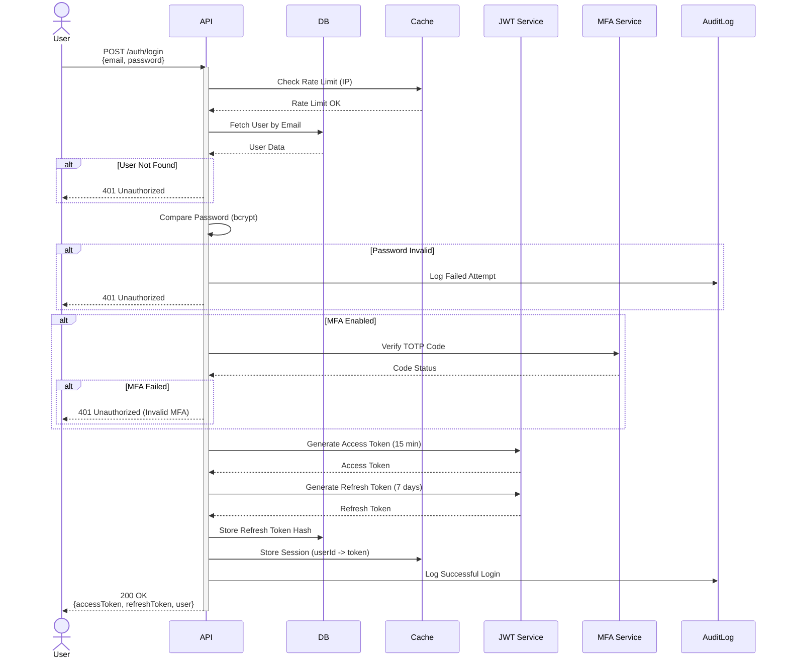
```mermaid
sequenceDiagram
    actor User
    participant API
    participant DB
    participant Cache
    participant JWT as JWT Service
    participant MFA as MFA Service
    participant AuditLog
    
    User->>API: POST /auth/login<br/>{email, password}
    activate API
    
    API->>Cache: Check Rate Limit (IP)
    Cache-->>API: Rate Limit OK
    
    API->>DB: Fetch User by Email
    DB-->>API: User Data
    
    alt User Not Found
        API-->>User: 401 Unauthorized
    end
    
    API->>API: Compare Password (bcrypt)
    
    alt Password Invalid
        API->>AuditLog: Log Failed Attempt
        API-->>User: 401 Unauthorized
    end
    
    alt MFA Enabled
        API->>MFA: Verify TOTP Code
        MFA-->>API: Code Status
        
        alt MFA Failed
            API-->>User: 401 Unauthorized (Invalid MFA)
        end
    end
    
    API->>JWT: Generate Access Token (15 min)
    JWT-->>API: Access Token
    
    API->>JWT: Generate Refresh Token (7 days)
    JWT-->>API: Refresh Token
    
    API->>DB: Store Refresh Token Hash
    API->>Cache: Store Session (userId -> token)
    
    API->>AuditLog: Log Successful Login
    
    API-->>User: 200 OK<br/>{accessToken, refreshToken, user}
    deactivate API
```

---

### Authorization Middleware Flow

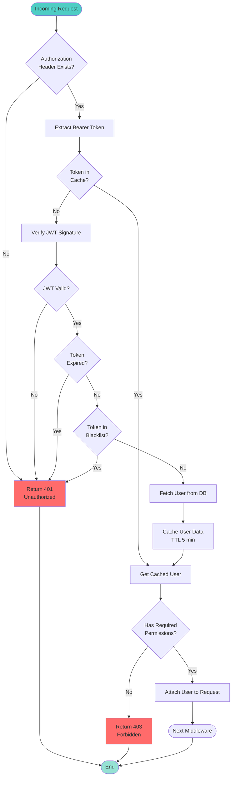
```mermaid
flowchart TD
    Start([Incoming Request]) --> CheckHeader{Authorization<br/>Header Exists?}
    
    CheckHeader -->|No| Return401[Return 401<br/>Unauthorized]
    CheckHeader -->|Yes| ExtractToken[Extract Bearer Token]
    
    ExtractToken --> CheckCache{Token in<br/>Cache?}
    
    CheckCache -->|Yes| GetCached[Get Cached User]
    CheckCache -->|No| VerifyJWT[Verify JWT Signature]
    
    VerifyJWT --> JWTValid{JWT Valid?}
    JWTValid -->|No| Return401
    JWTValid -->|Yes| CheckExpiry{Token<br/>Expired?}
    
    CheckExpiry -->|Yes| Return401
    CheckExpiry -->|No| CheckBlacklist{Token in<br/>Blacklist?}
    
    CheckBlacklist -->|Yes| Return401
    CheckBlacklist -->|No| FetchUser[Fetch User from DB]
    
    FetchUser --> CacheUser[Cache User Data<br/>TTL 5 min]
    CacheUser --> GetCached
    
    GetCached --> CheckPermissions{Has Required<br/>Permissions?}
    
    CheckPermissions -->|No| Return403[Return 403<br/>Forbidden]
    CheckPermissions -->|Yes| AttachUser[Attach User to Request]
    
    AttachUser --> NextMiddleware([Next Middleware])
    
    Return401 --> End([End])
    Return403 --> End
    NextMiddleware --> End
    
    style Start fill:#4ecdc4
    style End fill:#95e1d3
    style Return401 fill:#ff6b6b
    style Return403 fill:#ff6b6b
```

---

## 3. Transaction Processing (ACID)

### Complete Transaction Flow with Database Transaction

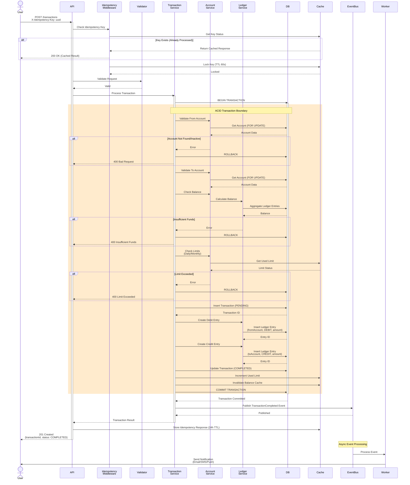
```mermaid
sequenceDiagram
    actor User
    participant API
    participant IdempotencyMW as Idempotency<br/>Middleware
    participant Validator
    participant TxnService as Transaction<br/>Service
    participant AccountService as Account<br/>Service
    participant LedgerService as Ledger<br/>Service
    participant DB
    participant Cache
    participant EventBus
    
    User->>API: POST /transactions<br/>X-Idempotency-Key: uuid
    activate API
    
    API->>IdempotencyMW: Check Idempotency Key
    IdempotencyMW->>Cache: Get Key Status
    
    alt Key Exists (Already Processed)
        Cache-->>IdempotencyMW: Return Cached Response
        IdempotencyMW-->>User: 200 OK (Cached Result)
    end
    
    IdempotencyMW->>Cache: Lock Key (TTL 60s)
    Cache-->>IdempotencyMW: Locked
    
    API->>Validator: Validate Request
    Validator-->>API: Valid
    
    API->>TxnService: Process Transaction
    activate TxnService
    
    TxnService->>DB: BEGIN TRANSACTION
    activate DB
    
    rect rgb(255, 235, 205)
        Note over TxnService,DB: ACID Transaction Boundary
        
        TxnService->>AccountService: Validate From Account
        AccountService->>DB: Get Account (FOR UPDATE)
        DB-->>AccountService: Account Data
        
        alt Account Not Found/Inactive
            AccountService-->>TxnService: Error
            TxnService->>DB: ROLLBACK
            TxnService-->>API: 400 Bad Request
        end
        
        TxnService->>AccountService: Validate To Account
        AccountService->>DB: Get Account (FOR UPDATE)
        DB-->>AccountService: Account Data
        
        TxnService->>AccountService: Check Balance
        AccountService->>LedgerService: Calculate Balance
        LedgerService->>DB: Aggregate Ledger Entries
        DB-->>LedgerService: Balance
        
        alt Insufficient Funds
            LedgerService-->>TxnService: Error
            TxnService->>DB: ROLLBACK
            TxnService-->>API: 400 Insufficient Funds
        end
        
        TxnService->>AccountService: Check Limits<br/>(Daily/Monthly)
        AccountService->>Cache: Get Used Limit
        Cache-->>AccountService: Limit Status
        
        alt Limit Exceeded
            AccountService-->>TxnService: Error
            TxnService->>DB: ROLLBACK
            TxnService-->>API: 400 Limit Exceeded
        end
        
        TxnService->>DB: Insert Transaction (PENDING)
        DB-->>TxnService: Transaction ID
        
        TxnService->>LedgerService: Create Debit Entry
        LedgerService->>DB: Insert Ledger Entry<br/>(fromAccount, DEBIT, amount)
        DB-->>LedgerService: Entry ID
        
        TxnService->>LedgerService: Create Credit Entry
        LedgerService->>DB: Insert Ledger Entry<br/>(toAccount, CREDIT, amount)
        DB-->>LedgerService: Entry ID
        
        TxnService->>DB: Update Transaction (COMPLETED)
        TxnService->>Cache: Increment Used Limit
        TxnService->>Cache: Invalidate Balance Cache
        
        TxnService->>DB: COMMIT TRANSACTION
    end
    
    deactivate DB
    DB-->>TxnService: Transaction Committed
    
    TxnService->>EventBus: Publish TransactionCompleted Event
    EventBus-->>TxnService: Published
    
    TxnService-->>API: Transaction Result
    deactivate TxnService
    
    API->>Cache: Store Idempotency Response (24h TTL)
    API-->>User: 201 Created<br/>{transactionId, status: COMPLETED}
    deactivate API
    
    Note over EventBus: Async Event Processing
    EventBus->>Worker: Process Event
    Worker->>User: Send Notification<br/>(Email/SMS/Push)
```

---

## 4. Idempotency & Retry Mechanism

### Idempotency Key Processing

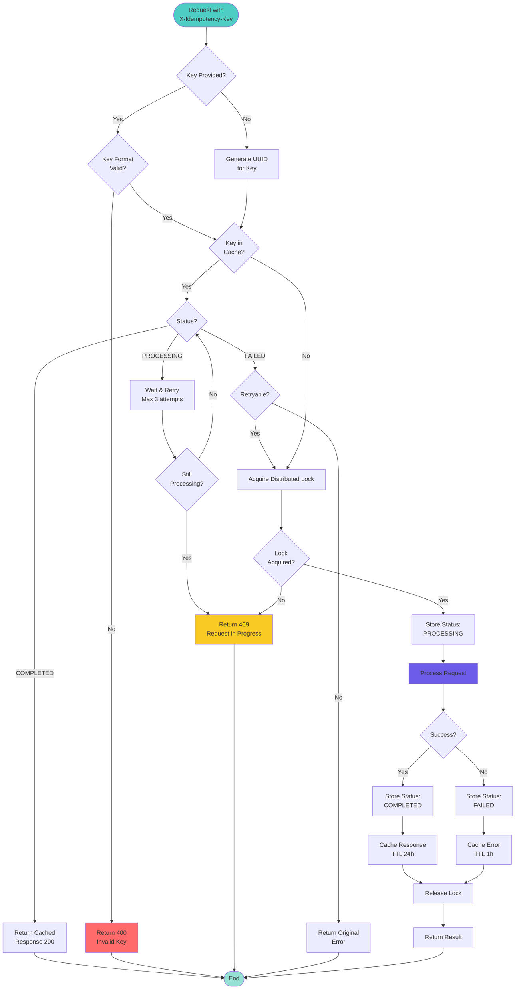
```mermaid
flowchart TD
    Start([Request with<br/>X-Idempotency-Key]) --> CheckKey{Key Provided?}
    
    CheckKey -->|No| GenerateKey[Generate UUID<br/>for Key]
    CheckKey -->|Yes| ValidateKey{Key Format<br/>Valid?}
    
    ValidateKey -->|No| Return400[Return 400<br/>Invalid Key]
    ValidateKey -->|Yes| CheckCache{Key in<br/>Cache?}
    
    GenerateKey --> CheckCache
    
    CheckCache -->|Yes| GetStatus{Status?}
    
    GetStatus -->|COMPLETED| ReturnCached[Return Cached<br/>Response 200]
    GetStatus -->|PROCESSING| Wait[Wait & Retry<br/>Max 3 attempts]
    GetStatus -->|FAILED| AllowRetry{Retryable?}
    
    AllowRetry -->|Yes| AcquireLock
    AllowRetry -->|No| ReturnError[Return Original<br/>Error]
    
    Wait --> PollCache{Still<br/>Processing?}
    PollCache -->|Yes| Return409[Return 409<br/>Request in Progress]
    PollCache -->|No| GetStatus
    
    CheckCache -->|No| AcquireLock[Acquire Distributed Lock]
    
    AcquireLock --> LockAcquired{Lock<br/>Acquired?}
    
    LockAcquired -->|No| Return409
    LockAcquired -->|Yes| StoreProcessing[Store Status:<br/>PROCESSING]
    
    StoreProcessing --> ProcessRequest[Process Request]
    
    ProcessRequest --> Success{Success?}
    
    Success -->|Yes| StoreCompleted[Store Status:<br/>COMPLETED]
    Success -->|No| StoreFailed[Store Status:<br/>FAILED]
    
    StoreCompleted --> CacheResponse[Cache Response<br/>TTL 24h]
    StoreFailed --> CacheError[Cache Error<br/>TTL 1h]
    
    CacheResponse --> ReleaseLock[Release Lock]
    CacheError --> ReleaseLock
    
    ReleaseLock --> ReturnResult[Return Result]
    
    ReturnCached --> End([End])
    Return400 --> End
    Return409 --> End
    ReturnError --> End
    ReturnResult --> End
    
    style Start fill:#4ecdc4
    style End fill:#95e1d3
    style Return400 fill:#ff6b6b
    style Return409 fill:#f9ca24
    style ProcessRequest fill:#6c5ce7
```

---

### Retry Strategy with Exponential Backoff

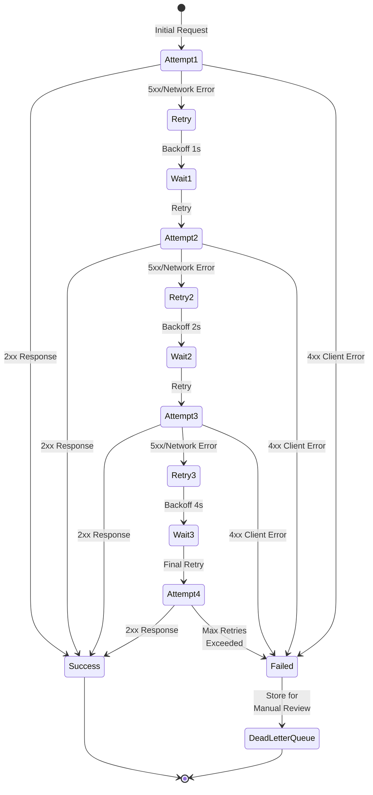
```mermaid
stateDiagram-v2
    [*] --> Attempt1: Initial Request
    
    Attempt1 --> Success: 2xx Response
    Attempt1 --> Retry: 5xx/Network Error
    Attempt1 --> Failed: 4xx Client Error
    
    Retry --> Wait1: Backoff 1s
    Wait1 --> Attempt2: Retry
    
    Attempt2 --> Success: 2xx Response
    Attempt2 --> Retry2: 5xx/Network Error
    Attempt2 --> Failed: 4xx Client Error
    
    Retry2 --> Wait2: Backoff 2s
    Wait2 --> Attempt3: Retry
    
    Attempt3 --> Success: 2xx Response
    Attempt3 --> Retry3: 5xx/Network Error
    Attempt3 --> Failed: 4xx Client Error
    
    Retry3 --> Wait3: Backoff 4s
    Wait3 --> Attempt4: Final Retry
    
    Attempt4 --> Success: 2xx Response
    Attempt4 --> Failed: Max Retries<br/>Exceeded
    
    Success --> [*]
    Failed --> DeadLetterQueue: Store for<br/>Manual Review
    DeadLetterQueue --> [*]
```

---

## 5. Double-Entry Ledger System

### Ledger Entry Creation (Double-Entry Bookkeeping)

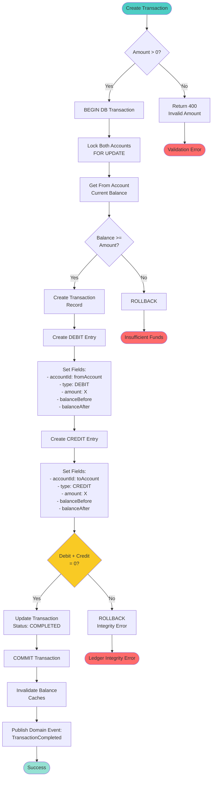
```mermaid
flowchart TD
    Start([Create Transaction]) --> ValidateAmount{Amount > 0?}
    
    ValidateAmount -->|No| Return400[Return 400<br/>Invalid Amount]
    ValidateAmount -->|Yes| BeginTx[BEGIN DB Transaction]
    
    BeginTx --> LockAccounts[Lock Both Accounts<br/>FOR UPDATE]
    
    LockAccounts --> GetFromBalance[Get From Account<br/>Current Balance]
    GetFromBalance --> CheckBalance{Balance >=<br/>Amount?}
    
    CheckBalance -->|No| Rollback1[ROLLBACK]
    CheckBalance -->|Yes| CreateTxn[Create Transaction<br/>Record]
    
    CreateTxn --> CreateDebit[Create DEBIT Entry]
    
    CreateDebit --> DebitFields[Set Fields:<br/>- accountId: fromAccount<br/>- type: DEBIT<br/>- amount: X<br/>- balanceBefore<br/>- balanceAfter]
    
    DebitFields --> CreateCredit[Create CREDIT Entry]
    
    CreateCredit --> CreditFields[Set Fields:<br/>- accountId: toAccount<br/>- type: CREDIT<br/>- amount: X<br/>- balanceBefore<br/>- balanceAfter]
    
    CreditFields --> ValidateBalance{Debit + Credit<br/>= 0?}
    
    ValidateBalance -->|No| Rollback2[ROLLBACK<br/>Integrity Error]
    ValidateBalance -->|Yes| UpdateTxnStatus[Update Transaction<br/>Status: COMPLETED]
    
    UpdateTxnStatus --> CommitTx[COMMIT Transaction]
    
    CommitTx --> InvalidateCache[Invalidate Balance<br/>Caches]
    
    InvalidateCache --> PublishEvent[Publish Domain Event:<br/>TransactionCompleted]
    
    PublishEvent --> End([Success])
    
    Rollback1 --> Error1([Insufficient Funds])
    Rollback2 --> Error2([Ledger Integrity Error])
    Return400 --> Error3([Validation Error])
    
    style Start fill:#4ecdc4
    style End fill:#95e1d3
    style Error1 fill:#ff6b6b
    style Error2 fill:#ff6b6b
    style Error3 fill:#ff6b6b
    style ValidateBalance fill:#f9ca24
```

---

### Balance Calculation from Ledger

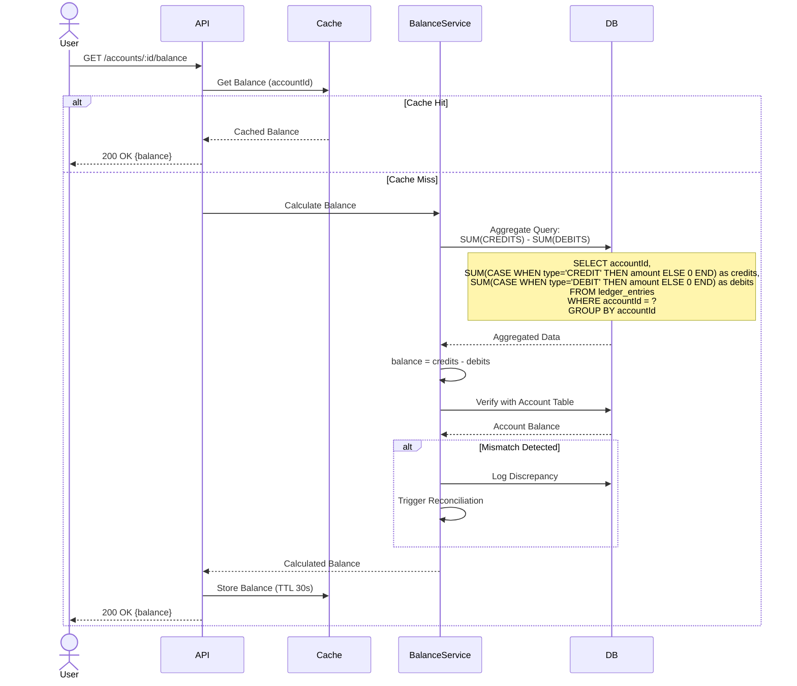
```mermaid
sequenceDiagram
    actor User
    participant API
    participant Cache
    participant BalanceService
    participant DB
    
    User->>API: GET /accounts/:id/balance
    
    API->>Cache: Get Balance (accountId)
    
    alt Cache Hit
        Cache-->>API: Cached Balance
        API-->>User: 200 OK {balance}
    else Cache Miss
        API->>BalanceService: Calculate Balance
        
        BalanceService->>DB: Aggregate Query:<br/>SUM(CREDITS) - SUM(DEBITS)
        
        Note over DB: SELECT accountId,<br/>SUM(CASE WHEN type='CREDIT' THEN amount ELSE 0 END) as credits,<br/>SUM(CASE WHEN type='DEBIT' THEN amount ELSE 0 END) as debits<br/>FROM ledger_entries<br/>WHERE accountId = ?<br/>GROUP BY accountId
        
        DB-->>BalanceService: Aggregated Data
        
        BalanceService->>BalanceService: balance = credits - debits
        
        BalanceService->>DB: Verify with Account Table
        DB-->>BalanceService: Account Balance
        
        alt Mismatch Detected
            BalanceService->>DB: Log Discrepancy
            BalanceService->>BalanceService: Trigger Reconciliation
        end
        
        BalanceService-->>API: Calculated Balance
        
        API->>Cache: Store Balance (TTL 30s)
        API-->>User: 200 OK {balance}
    end
```

---

## 6. Balance Calculation & Caching

### Multi-Layer Caching Strategy

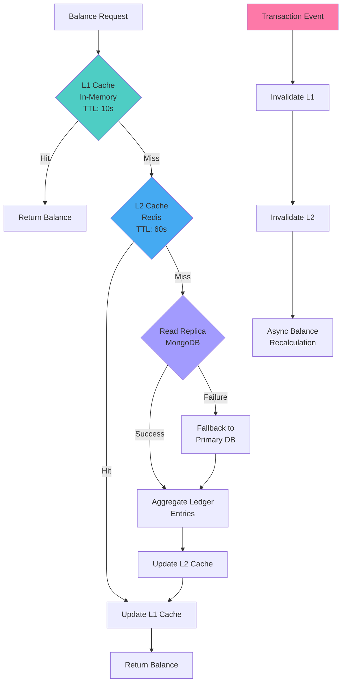
```mermaid
graph TB
    Request[Balance Request] --> L1Cache{L1 Cache<br/>In-Memory<br/>TTL: 10s}
    
    L1Cache -->|Hit| Return1[Return Balance]
    L1Cache -->|Miss| L2Cache{L2 Cache<br/>Redis<br/>TTL: 60s}
    
    L2Cache -->|Hit| UpdateL1[Update L1 Cache]
    L2Cache -->|Miss| DBRead{Read Replica<br/>MongoDB}
    
    UpdateL1 --> Return2[Return Balance]
    
    DBRead -->|Success| Aggregate[Aggregate Ledger<br/>Entries]
    DBRead -->|Failure| Fallback[Fallback to<br/>Primary DB]
    
    Aggregate --> UpdateL2[Update L2 Cache]
    Fallback --> Aggregate
    
    UpdateL2 --> UpdateL1
    
    TransactionEvent[Transaction Event] --> InvalidateL1[Invalidate L1]
    InvalidateL1 --> InvalidateL2[Invalidate L2]
    InvalidateL2 --> AsyncUpdate[Async Balance<br/>Recalculation]
    
    style L1Cache fill:#4ecdc4
    style L2Cache fill:#45aaf2
    style DBRead fill:#a29bfe
    style TransactionEvent fill:#fd79a8
```

---

## 7. Reconciliation & Audit

### Daily Reconciliation Process

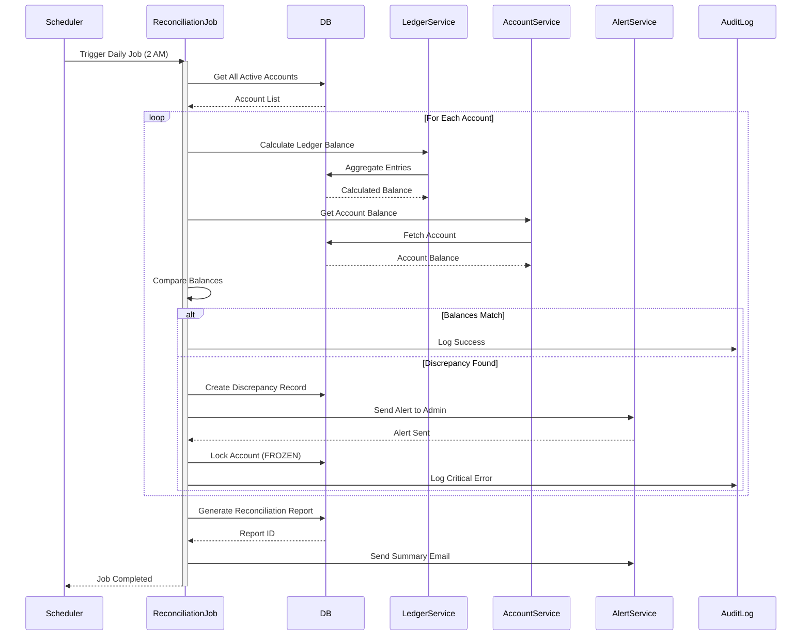
```mermaid
sequenceDiagram
    participant Scheduler
    participant ReconciliationJob
    participant DB
    participant LedgerService
    participant AccountService
    participant AlertService
    participant AuditLog
    
    Scheduler->>ReconciliationJob: Trigger Daily Job (2 AM)
    activate ReconciliationJob
    
    ReconciliationJob->>DB: Get All Active Accounts
    DB-->>ReconciliationJob: Account List
    
    loop For Each Account
        ReconciliationJob->>LedgerService: Calculate Ledger Balance
        LedgerService->>DB: Aggregate Entries
        DB-->>LedgerService: Calculated Balance
        
        ReconciliationJob->>AccountService: Get Account Balance
        AccountService->>DB: Fetch Account
        DB-->>AccountService: Account Balance
        
        ReconciliationJob->>ReconciliationJob: Compare Balances
        
        alt Balances Match
            ReconciliationJob->>AuditLog: Log Success
        else Discrepancy Found
            ReconciliationJob->>DB: Create Discrepancy Record
            ReconciliationJob->>AlertService: Send Alert to Admin
            AlertService-->>ReconciliationJob: Alert Sent
            
            ReconciliationJob->>DB: Lock Account (FROZEN)
            ReconciliationJob->>AuditLog: Log Critical Error
        end
    end
    
    ReconciliationJob->>DB: Generate Reconciliation Report
    DB-->>ReconciliationJob: Report ID
    
    ReconciliationJob->>AlertService: Send Summary Email
    
    ReconciliationJob-->>Scheduler: Job Completed
    deactivate ReconciliationJob
```

---

## 8. Error Handling & Circuit Breaker

### Circuit Breaker Pattern

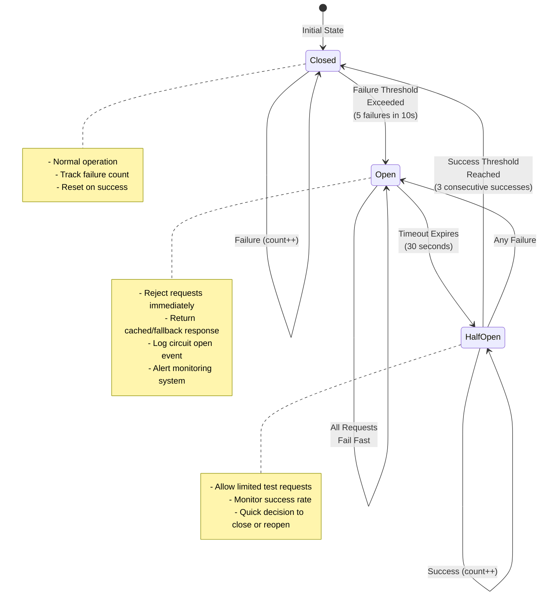
```mermaid
stateDiagram-v2
    [*] --> Closed: Initial State
    
    Closed --> Open: Failure Threshold<br/>Exceeded<br/>(5 failures in 10s)
    Closed --> Closed: Success
    Closed --> Closed: Failure (count++)
    
    Open --> HalfOpen: Timeout Expires<br/>(30 seconds)
    Open --> Open: All Requests<br/>Fail Fast
    
    HalfOpen --> Closed: Success Threshold<br/>Reached<br/>(3 consecutive successes)
    HalfOpen --> Open: Any Failure
    HalfOpen --> HalfOpen: Success (count++)
    
    note right of Open
        - Reject requests immediately
        - Return cached/fallback response
        - Log circuit open event
        - Alert monitoring system
    end note
    
    note right of HalfOpen
        - Allow limited test requests
        - Monitor success rate
        - Quick decision to close or reopen
    end note
    
    note right of Closed
        - Normal operation
        - Track failure count
        - Reset on success
    end note
```

---

### Global Error Handler

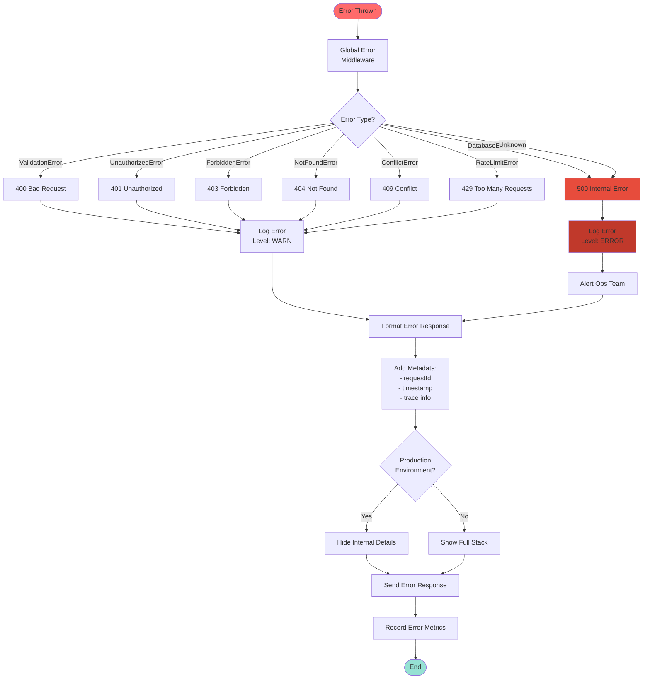
```mermaid
flowchart TD
    Start([Error Thrown]) --> CatchError[Global Error<br/>Middleware]
    
    CatchError --> CheckType{Error Type?}
    
    CheckType -->|ValidationError| Handle400[400 Bad Request]
    CheckType -->|UnauthorizedError| Handle401[401 Unauthorized]
    CheckType -->|ForbiddenError| Handle403[403 Forbidden]
    CheckType -->|NotFoundError| Handle404[404 Not Found]
    CheckType -->|ConflictError| Handle409[409 Conflict]
    CheckType -->|RateLimitError| Handle429[429 Too Many Requests]
    CheckType -->|DatabaseError| Handle500[500 Internal Error]
    CheckType -->|Unknown| Handle500
    
    Handle400 --> LogError[Log Error<br/>Level: WARN]
    Handle401 --> LogError
    Handle403 --> LogError
    Handle404 --> LogError
    Handle409 --> LogError
    Handle429 --> LogError
    Handle500 --> LogCritical[Log Error<br/>Level: ERROR]
    
    LogError --> FormatResponse[Format Error Response]
    LogCritical --> AlertOps[Alert Ops Team]
    
    AlertOps --> FormatResponse
    
    FormatResponse --> AddMetadata[Add Metadata:<br/>- requestId<br/>- timestamp<br/>- trace info]
    
    AddMetadata --> SanitizeError{Production<br/>Environment?}
    
    SanitizeError -->|Yes| HideDetails[Hide Internal Details]
    SanitizeError -->|No| ShowDetails[Show Full Stack]
    
    HideDetails --> SendResponse[Send Error Response]
    ShowDetails --> SendResponse
    
    SendResponse --> RecordMetrics[Record Error Metrics]
    
    RecordMetrics --> End([End])
    
    style Start fill:#ff6b6b
    style End fill:#95e1d3
    style Handle500 fill:#e74c3c
    style LogCritical fill:#c0392b
```

---

## 9. Event-Driven Architecture

### Event Publishing & Processing

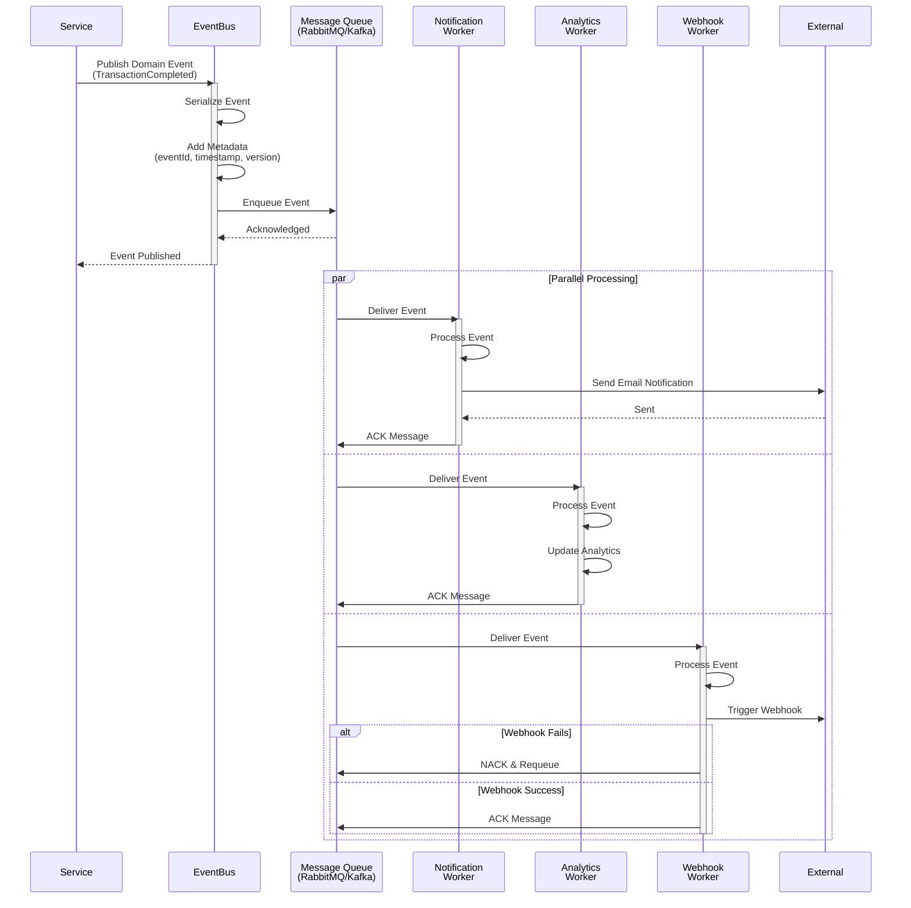
```mermaid
sequenceDiagram
    participant Service
    participant EventBus
    participant Queue as Message Queue<br/>(RabbitMQ/Kafka)
    participant Worker1 as Notification<br/>Worker
    participant Worker2 as Analytics<br/>Worker
    participant Worker3 as Webhook<br/>Worker
    participant External
    
    Service->>EventBus: Publish Domain Event<br/>(TransactionCompleted)
    activate EventBus
    
    EventBus->>EventBus: Serialize Event
    EventBus->>EventBus: Add Metadata<br/>(eventId, timestamp, version)
    
    EventBus->>Queue: Enqueue Event
    Queue-->>EventBus: Acknowledged
    
    EventBus-->>Service: Event Published
    deactivate EventBus
    
    par Parallel Processing
        Queue->>Worker1: Deliver Event
        activate Worker1
        Worker1->>Worker1: Process Event
        Worker1->>External: Send Email Notification
        External-->>Worker1: Sent
        Worker1->>Queue: ACK Message
        deactivate Worker1
    and
        Queue->>Worker2: Deliver Event
        activate Worker2
        Worker2->>Worker2: Process Event
        Worker2->>Worker2: Update Analytics
        Worker2->>Queue: ACK Message
        deactivate Worker2
    and
        Queue->>Worker3: Deliver Event
        activate Worker3
        Worker3->>Worker3: Process Event
        Worker3->>External: Trigger Webhook
        
        alt Webhook Fails
            Worker3->>Queue: NACK & Requeue
        else Webhook Success
            Worker3->>Queue: ACK Message
        end
        deactivate Worker3
    end
```

---

## 10. Distributed Tracing & Monitoring

### Request Tracing Flow

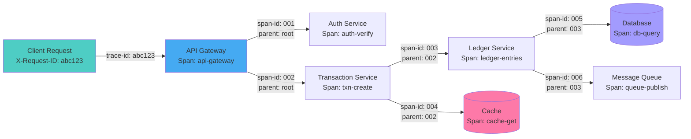
```mermaid
graph LR
    Client[Client Request<br/>X-Request-ID: abc123]
    
    API[API Gateway<br/>Span: api-gateway]
    Auth[Auth Service<br/>Span: auth-verify]
    TxnSvc[Transaction Service<br/>Span: txn-create]
    LedgerSvc[Ledger Service<br/>Span: ledger-entries]
    DB[(Database<br/>Span: db-query)]
    Cache[(Cache<br/>Span: cache-get)]
    Queue[Message Queue<br/>Span: queue-publish]
    
    Client -->|trace-id: abc123| API
    API -->|span-id: 001<br/>parent: root| Auth
    API -->|span-id: 002<br/>parent: root| TxnSvc
    
    TxnSvc -->|span-id: 003<br/>parent: 002| LedgerSvc
    TxnSvc -->|span-id: 004<br/>parent: 002| Cache
    
    LedgerSvc -->|span-id: 005<br/>parent: 003| DB
    LedgerSvc -->|span-id: 006<br/>parent: 003| Queue
    
    style Client fill:#4ecdc4
    style API fill:#45aaf2
    style DB fill:#a29bfe
    style Cache fill:#fd79a8
```

---

### Metrics Collection

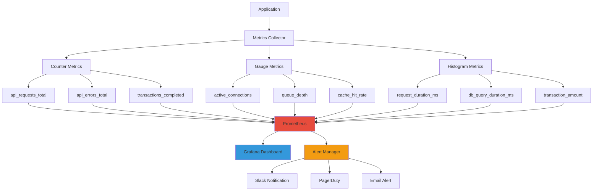
```mermaid
flowchart TD
    App[Application] --> Metrics[Metrics Collector]
    
    Metrics --> Counter[Counter Metrics]
    Metrics --> Gauge[Gauge Metrics]
    Metrics --> Histogram[Histogram Metrics]
    
    Counter --> C1[api_requests_total]
    Counter --> C2[api_errors_total]
    Counter --> C3[transactions_completed]
    
    Gauge --> G1[active_connections]
    Gauge --> G2[queue_depth]
    Gauge --> G3[cache_hit_rate]
    
    Histogram --> H1[request_duration_ms]
    Histogram --> H2[db_query_duration_ms]
    Histogram --> H3[transaction_amount]
    
    C1 --> Prometheus[Prometheus]
    C2 --> Prometheus
    C3 --> Prometheus
    G1 --> Prometheus
    G2 --> Prometheus
    G3 --> Prometheus
    H1 --> Prometheus
    H2 --> Prometheus
    H3 --> Prometheus
    
    Prometheus --> Grafana[Grafana Dashboard]
    Prometheus --> AlertManager[Alert Manager]
    
    AlertManager --> Slack[Slack Notification]
    AlertManager --> PagerDuty[PagerDuty]
    AlertManager --> Email[Email Alert]
    
    style Prometheus fill:#e74c3c
    style Grafana fill:#3498db
    style AlertManager fill:#f39c12
```

---

## 11. Rate Limiting & DDoS Protection

### Multi-Layer Rate Limiting

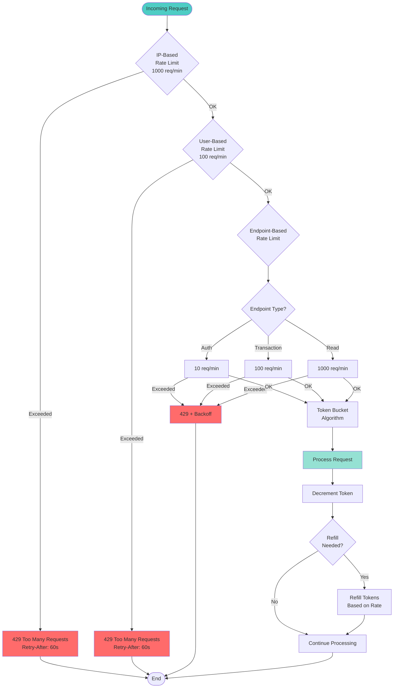
```mermaid
flowchart TD
    Request([Incoming Request]) --> IPLimit{IP-Based<br/>Rate Limit<br/>1000 req/min}
    
    IPLimit -->|Exceeded| Return429_1[429 Too Many Requests<br/>Retry-After: 60s]
    IPLimit -->|OK| UserLimit{User-Based<br/>Rate Limit<br/>100 req/min}
    
    UserLimit -->|Exceeded| Return429_2[429 Too Many Requests<br/>Retry-After: 60s]
    UserLimit -->|OK| EndpointLimit{Endpoint-Based<br/>Rate Limit}
    
    EndpointLimit --> CheckEndpoint{Endpoint Type?}
    
    CheckEndpoint -->|Auth| AuthLimit[10 req/min]
    CheckEndpoint -->|Transaction| TxnLimit[100 req/min]
    CheckEndpoint -->|Read| ReadLimit[1000 req/min]
    
    AuthLimit -->|Exceeded| Return429_3[429 + Backoff]
    TxnLimit -->|Exceeded| Return429_3
    ReadLimit -->|Exceeded| Return429_3
    
    AuthLimit -->|OK| TokenBucket[Token Bucket<br/>Algorithm]
    TxnLimit -->|OK| TokenBucket
    ReadLimit -->|OK| TokenBucket
    
    TokenBucket --> Success[Process Request]
    
    Success --> DecrementToken[Decrement Token]
    DecrementToken --> RefillCheck{Refill<br/>Needed?}
    
    RefillCheck -->|Yes| RefillTokens[Refill Tokens<br/>Based on Rate]
    RefillCheck -->|No| Continue
    
    RefillTokens --> Continue[Continue Processing]
    
    Return429_1 --> End([End])
    Return429_2 --> End
    Return429_3 --> End
    Continue --> End
    
    style Request fill:#4ecdc4
    style Success fill:#95e1d3
    style Return429_1 fill:#ff6b6b
    style Return429_2 fill:#ff6b6b
    style Return429_3 fill:#ff6b6b
```

---

## 12. Webhook Delivery System

### Webhook Delivery with Retry

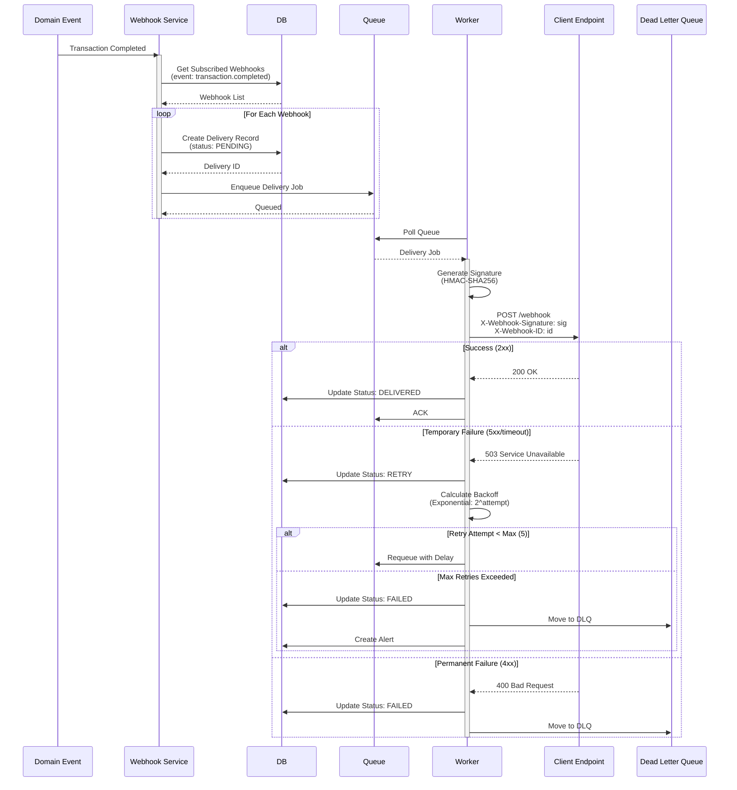
```mermaid
sequenceDiagram
    participant Event as Domain Event
    participant WebhookSvc as Webhook Service
    participant DB
    participant Queue
    participant Worker
    participant Client as Client Endpoint
    participant DLQ as Dead Letter Queue
    
    Event->>WebhookSvc: Transaction Completed
    activate WebhookSvc
    
    WebhookSvc->>DB: Get Subscribed Webhooks<br/>(event: transaction.completed)
    DB-->>WebhookSvc: Webhook List
    
    loop For Each Webhook
        WebhookSvc->>DB: Create Delivery Record<br/>(status: PENDING)
        DB-->>WebhookSvc: Delivery ID
        
        WebhookSvc->>Queue: Enqueue Delivery Job
        Queue-->>WebhookSvc: Queued
    end
    
    deactivate WebhookSvc
    
    Worker->>Queue: Poll Queue
    Queue-->>Worker: Delivery Job
    activate Worker
    
    Worker->>Worker: Generate Signature<br/>(HMAC-SHA256)
    
    Worker->>Client: POST /webhook<br/>X-Webhook-Signature: sig<br/>X-Webhook-ID: id
    
    alt Success (2xx)
        Client-->>Worker: 200 OK
        Worker->>DB: Update Status: DELIVERED
        Worker->>Queue: ACK
    else Temporary Failure (5xx/timeout)
        Client-->>Worker: 503 Service Unavailable
        Worker->>DB: Update Status: RETRY
        Worker->>Worker: Calculate Backoff<br/>(Exponential: 2^attempt)
        
        alt Retry Attempt < Max (5)
            Worker->>Queue: Requeue with Delay
        else Max Retries Exceeded
            Worker->>DB: Update Status: FAILED
            Worker->>DLQ: Move to DLQ
            Worker->>DB: Create Alert
        end
    else Permanent Failure (4xx)
        Client-->>Worker: 400 Bad Request
        Worker->>DB: Update Status: FAILED
        Worker->>DLQ: Move to DLQ
    end
    
    deactivate Worker
```

---

## 13. Bulk Transaction Processing

### Batch Payment Flow

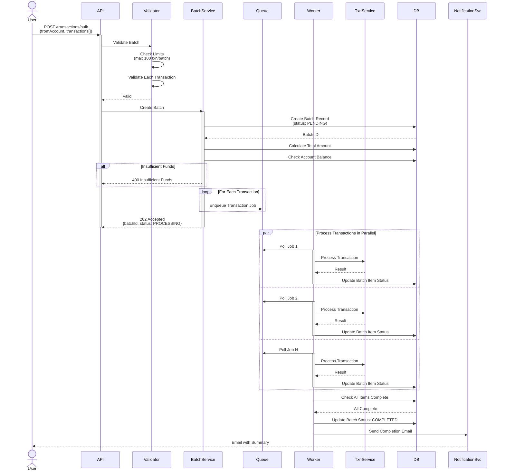
```mermaid
sequenceDiagram
    actor User
    participant API
    participant Validator
    participant BatchService
    participant Queue
    participant Worker
    participant TxnService
    participant DB
    participant NotificationSvc
    
    User->>API: POST /transactions/bulk<br/>{fromAccount, transactions[]}
    activate API
    
    API->>Validator: Validate Batch
    Validator->>Validator: Check Limits<br/>(max 100 txn/batch)
    Validator->>Validator: Validate Each Transaction
    Validator-->>API: Valid
    
    API->>BatchService: Create Batch
    activate BatchService
    
    BatchService->>DB: Create Batch Record<br/>(status: PENDING)
    DB-->>BatchService: Batch ID
    
    BatchService->>DB: Calculate Total Amount
    BatchService->>DB: Check Account Balance
    
    alt Insufficient Funds
        BatchService-->>API: 400 Insufficient Funds
    end
    
    loop For Each Transaction
        BatchService->>Queue: Enqueue Transaction Job
    end
    
    BatchService-->>API: 202 Accepted<br/>{batchId, status: PROCESSING}
    deactivate API
    deactivate BatchService
    
    par Process Transactions in Parallel
        Worker->>Queue: Poll Job 1
        activate Worker
        Worker->>TxnService: Process Transaction
        TxnService-->>Worker: Result
        Worker->>DB: Update Batch Item Status
        deactivate Worker
    and
        Worker->>Queue: Poll Job 2
        activate Worker
        Worker->>TxnService: Process Transaction
        TxnService-->>Worker: Result
        Worker->>DB: Update Batch Item Status
        deactivate Worker
    and
        Worker->>Queue: Poll Job N
        activate Worker
        Worker->>TxnService: Process Transaction
        TxnService-->>Worker: Result
        Worker->>DB: Update Batch Item Status
        deactivate Worker
    end
    
    Worker->>DB: Check All Items Complete
    DB-->>Worker: All Complete
    
    Worker->>DB: Update Batch Status: COMPLETED
    Worker->>NotificationSvc: Send Completion Email
    NotificationSvc-->>User: Email with Summary
```

---

## Summary

This comprehensive flow diagram document covers:

✅ **Architecture**: Multi-layer system design with load balancing, caching, and messaging  
✅ **Authentication**: JWT-based auth with MFA, token refresh, and session management  
✅ **Transactions**: ACID-compliant transactions with proper locking and rollback  
✅ **Idempotency**: Distributed locking and retry strategies  
✅ **Ledger**: Double-entry bookkeeping with integrity checks  
✅ **Caching**: Multi-layer caching strategy for performance  
✅ **Reconciliation**: Daily reconciliation and discrepancy detection  
✅ **Error Handling**: Circuit breaker pattern and global error handling  
✅ **Events**: Event-driven architecture with async processing  
✅ **Tracing**: Distributed tracing with OpenTelemetry  
✅ **Rate Limiting**: Multi-layer rate limiting with token bucket  
✅ **Webhooks**: Reliable webhook delivery with retries and DLQ  

This forms the blueprint for a **production-grade, resilient, highly scalable ledger API**. Each flow diagram can be implemented phase by phase.
